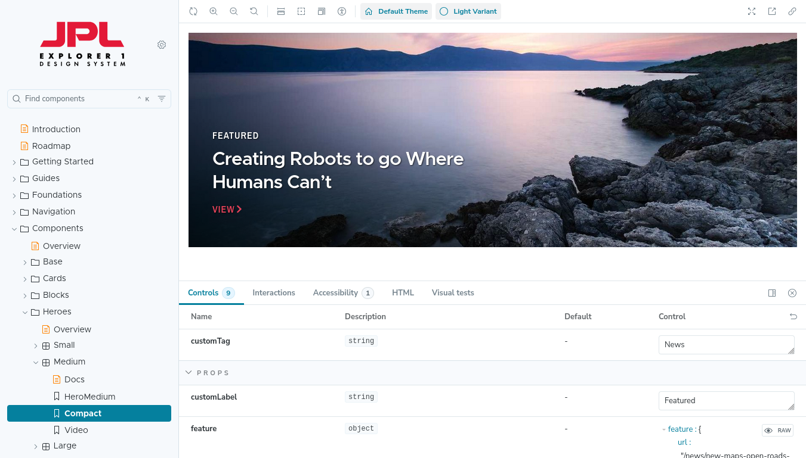

# Using Storybook To Preview Single Directory Components

<p class="centre">Philip Norton<br>
<small>DrupalCamp Scotland 2025</small></p>
<!-- Speaker notes will appear here. -->

---

# Philip Norton
- Developer at Code Enigma
- Writer at `#! code` (www.hashbangcode.com)
- NWDUG co-organiser


<!--
- Doing Drupal for about 15 years.
- Programming in general for about 20 now.
- That is a picture of a Lily58 mechanical keyboard.
-->

---

<!-- _footer: "" -->
## Source Code
- Talk is available at:
<small>https://github.com/hashbangcode/drupal-storybook-talk</small> or via QR code.
- All code seen can be found at <small>[http://bit.ly/3W1bnu0](https://github.com/hashbangcode/drupal-storybook)</small>
- <small>[www.hashbangcode.com](https://www.hashbangcode.com)</small>


<!-- 
- Scan the QR code for the talk repo. Which has links to all of the resources you need.
- There's also a Drupal and Storybook article on my site.
-->


---
<!-- _footer: '' -->
# What Is Storybook?

- Storybook is a frontend tool for creating UI components.



<!--

I've been looking at Storybook for a few years, but there's always been a disconnect between Storybook and Drupal. I could build the stories in Storybook, but I'd then have to rebuild them in Drupal.

Here is an example of Storybook used by the JPL.

-->
---

# Why Single Directory Components?

- An important part of modern Drupal theme development.
- Can be added to themes or modules.
- Integrates with **Drupal Canvas**.

<!-- 

Now is a good time to get into SDC.

-->
---

# Contents

- Introduction To **Single Directory Components**
- Installing the **Storybook Module**
- Installing and running **Storybook**

<!--

That changed with SDC and is facilitied by the Storybook module.

-->

---

## Single Directory Components (SDC)

A _very_ short introduction.

---
<!-- _footer: '' -->
## SDC


---
<!-- _footer: '' -->
## SDC


---

## SDC

- They exist in a single directory (hence the name).

```
example_component/
    example_component.component.yml
    example_component.css
    example_component.js
    example_component.twig
```
<!--
This directory can exist in a theme or module.
Let's look at each of the files.
-->
---

## SDC - *.component.yml

- The `*.component.yml` file is used to define the structure of the component.

```yml
name: My Component

props:
  type: object
  properties:
    # ...

slots:
  # ...
```

---
<!-- _footer: '' -->
## SDC - *.component.yml

- `props` have defined properties with set data types.

```yml
props:
  type: object
  properties:
    title:
      type: ['string', 'null']
      title: Extra classes
      examples:
        - extrawide, dark
```

- `{{ title }}` can now be used in the template.

---

## SDC - *.component.yml

- `slots` are much simpler to define.

```yml
slots:
  body:
    title: "Body copy."
```

- `{{ body }}` is now available in the template.

---

## SDC - Props vs Slots

- `props` - Properties or simple elements that the component has. Title, classes, menu depth, display options, etc.
- `slots` - Objects or more complex elements that the component can render. Body copy, images etc.

---
<!-- _footer: '' -->
## SDC - *.twig

- A normal twig template that renders the defined structure of the component.

Slot in a *.component.yml file:

```yml
slots:
  title:
    title: "Title"
```

Twig template:

```html
{{ title }}
```

---

## SDC - *.twig

- You should probably add `slots` using the `block` Twig tag.

```twig

  {{ title }}

```

- This allows you to override the value in Storybook without having to add `|raw` to your Twig template.

---

## SDC - Other files

- Any `*.css` or `*.js` files will be automatically inclued as attachments.

- Template and CSS can reference files inside the SDC.


[[[ add some examples of images being referenced from SDC ]]] 

---

## SDC - Usage

- With the SDC created we can now add it to our Drupal template templates.

```html
{{ include('my_theme:example_component', {
  title: label,
  body: content.body,
}) }}
```

---

## SDC - Usage

- An example of rendering an Author content type.

```html
{{ include('my_theme:author', {
  author_url: url,
  name: label,
  bio: content.field_author_short_bio,
  avatar: content.field_author_avatar
}) }}
```

---

# Storybook Module

---

## Storybook Module

- Require and install the Storybook module

```
composer require drupal/storybook
drush en storybook
```

---

## Storybook Module - Permissions

- Ensure that the correct permissions are set.

```
drush role:perm:add anonymous 'render storybook stories'
```

---

## Storybook Module - Stories

- For each component you want to test you need a `*.stories.twig` file.
- This contains a number of examples of the SDC in use.
- Add additional markup or other components to the story.

---
<!-- _footer: '' -->
## Storybook Module - Stories

```twig


  
  
  

  
  

```

---

## Storybook Module - Stories

- [[ look at how stories are translated into Storybook previews ]]

---

## Storybook Module - Stories

- Use `include` for simple components.

<div class="left">
<p class="small-text">example_component.twig</p>

```twig
<div>
  <h2>{{ title }}</h2>
</div>
```

</div>

<div class="right">
<p class="small-text">example_component.stories.twig</p>

```twig
  
  {{ include('my_theme:example_component', {  
    title
  }) }}
```
</div>

---
<!-- _footer: '' -->
## Storybook Module - Stories

- Use `embed` with more complex components that have slots.

<div class="left">
<p class="small-text">example_component.twig</p>

```twig
<div>

  {{ body }}

</div>
```

</div>

<div class="right">
<p class="small-text">example_component.stories.twig</p>

```twig
---
  
  
    
      {{ body|raw }}
    
  
---
```

</div>

--- 

## Storybook Module - Stories

- Storybook doesn't understand `*.stories.twig` files.
- They need converting into `*.stories.json`.
- This Storybook module comes with a couple of Drush commands to do this.
 
```
drush storybook:generate-all-stories
```

---

# Drupal Setup

- Some settings are needed to allow Storybook to connect to Drupal.

---
<!-- _footer: '' -->
## Drupal Setup - CORS Prevention

- Add these rules to `development.services.yml` file.

```yml
parameters:
  storybook.development: true
  cors.config:
    enabled: true
    allowedHeaders: [ '*' ]
    allowedMethods: [ '*' ]
    allowedOrigins: [ '*' ]
    exposedHeaders: false
    maxAge: false
    supportsCredentials: true
```

---

## Drupal Setup - CORS Prevention

- Add a reference to the services file from the `settings.php` file.

```php
$settings['container_yamls'][] = DRUPAL_ROOT . '/sites/development.services.yml';
```
---

## Drupal Setup - Twig Debug

Turn on the theme development settings.

```yml
drush state:set twig_debug 1
drush state:set twig_cache_disable 1
drush state:set disable_rendered_output_cache_bins 1
```

[[[[ Insert a picutre of the twig debug page here ]]]]

---

# Storybook

---

## Storybook - Install

- Install Storybook in a separate directory, away from your Drupal root. 
- Eg. .

```
npm init -y
npx storybook init --type server
```

---


## Storybook - Install

- This will give you a directory containing.

```
.storybook
stories
node_modules
package.json
package-lock.json
```
<!-- 
- .storybook is the storybook configuration directory.
- stories contains some example stories.
- The other directories are standard node directories.
-->

---
## Storybook - Configure

- Edit the `.storybook/main.js` file to point Storybook at your stories.

```json
"stories": [
    "../../web/themes/custom/my_theme/components/**/*.stories.@(json|yaml|yml)"
  ],
```
<!--
Remember that you can have stories in themes and modules, so you can have multiple lines here pointing at different directories.
The modules and themes don't need to be active, as long as they have a *.stories.twig
-->

---

## Running Storybook

- Storybook is a JavaScript application that can be run on its own.

```
npm run storybook
```

- This will open a browser window with the address http://localhost:6006.

---

## Running Storybook - DDEV

- If you are using DDEV then can run Storybook from inside the web container, with some config.

```yml
web_extra_exposed_ports:
  - name: storybook
    container_port: 6006
    http_port: 6007
    https_port: 6006
web_extra_daemons:
  - name: node.js
    command: "tail -F package.json > /dev/null"
    directory: /var/www/html/tests
```

--- 

## Running Storybook - DDEV

- To stop DDEV complaining you may want to add <br> `--no-open` flag the relevant line in the `package.json` file to prevent the browser opening.

```
  "scripts": {
    "storybook": "storybook dev -p 6006 --no-open",
    "build-storybook": "storybook build"
  },
```

---

## Building Storybook

- Storybook can also be built as a static website.

```
npm run build-storybook
```

- The static site can be deployed and served as a site.

---

## Hosting Storybook

- Use the following nginx configuration.

```php
location ^~ /storybook-static {
  add_header "Access-Control-Allow-Origin" *;
  add_header "Access-Control-Allow-Methods" "GET, POST, OPTIONS";
  disable_symlinks off;
  alias /your/project/directory/tests/storybook-static;
  index index.html;
}
```

---

# Workflow

- A workflow for building a component.

  - Create story for component
  - Build (or run) storybook
  - Preview story
  - Once the SDC is complete, add it to your template.

---

# Demo

---

# Tips

- Look for CORS errors.
- If you only see a blank screen, check Drupal logs.
- Be aware that Drupal will wrap some things with extra elements. That might throw off your positioning and margins.
- Setup a styleguide storybook.

---

# Tips

- Understand props and slots.
- Don't abstract too much with SDC.
- Don't try to cover too much with SDC.

---

# Alternatives

---

- [SDC - Component library](https://www.drupal.org/project/sdc_component_library)

[[[ADD SCREENSHOT OF SDC COMPONENT LIBRARY MODUE N USE HERE]]]


---

# Alternatives

- [Single Directory Components Styleguide](https://www.drupal.org/project/sdc_styleguide)


[[[ADD SCREENSHOT OF SDC COMPONENT STYLEGUIDE MODUE N USE HERE]]]

---

# Resources

- [Storybook](https://storybook.js.org/)
- [Storybook Module](https://www.drupal.org/project/storybook)
- [Drupal Documentation on SDC](https://www.drupal.org/docs/develop/theming-drupal/using-single-directory-components)
- [Drupal 11: Using Storybook To Preview Single Directory Components](https://www.hashbangcode.com/article/drupal-11-using-storybook-preview-single-directory-components)


---

## Questions?

- Slides: https://github.com/hashbangcode/drupal-storybook-talk


---

## Thanks!

- Slides: https://github.com/hashbangcode/drupal-storybook-talk


